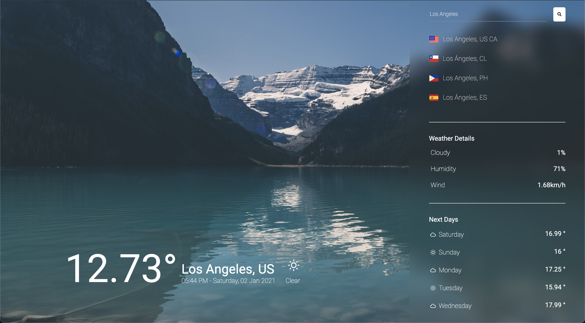

# 🌨☀️🌧 Weather App Built with React 🌤🌦❄️

## How to run?

1. Clone the project.
2. Run `yarn install`.
3. Create a `.env` file in the root of the project.
4. Add an <a href="https://openweathermap.org/api" target="_blank">Openweathermap api key</a> to the `.env` file.
5. Add an <a href="https://timezonedb.com/api" target="_blank">TimezoneDB api key</a> to the `.env` file.
6. Finally, Run `yarn start`

## Demo

<a href="https://jeangel.github.io/weather-app/" target="_blank">Online weather app demo</a>

## Example image

